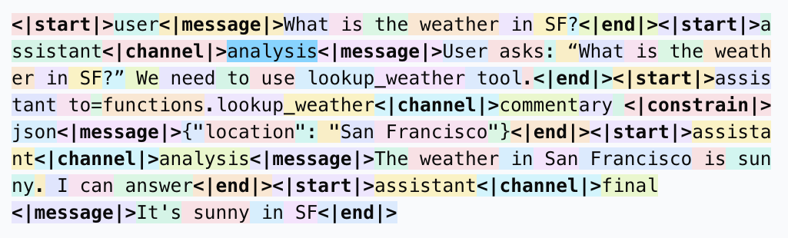

<center>

<h1 align="center">OpenAI Harmony</h1>
<p align="center">OpenAI's response format for its open-weight model series <a href="https://openai.com/open-models">gpt-oss</a>
<br>
<a href="https://gpt-oss.com" target="_blank">Try gpt-oss</a> | <a href="https://cookbook.openai.com/topic/gpt-oss">Learn more</a> | <a href="https://openai.com/index/gpt-oss-model-card/">Model card</a>
</p>
<br>
</center>

The [gpt-oss models][gpt-oss] were trained on the [harmony response format][harmony-format] for defining conversation structures, generating reasoning output and structuring function calls. If you are not using gpt-oss directly but through an API or a provider like HuggingFace, Ollama, or vLLM, you will not have to be concerned about this as your inference solution will handle the formatting. If you are building your own inference solution, this guide will walk you through the prompt format. The format is designed to mimic the OpenAI Responses API, so if you have used that API before, this format should hopefully feel familiar to you. gpt-oss should not be used without using the harmony format as it will not work correctly.

The format enables the model to output to multiple different channels for chain of thought, and tool calling preambles along with regular responses. It also enables specifying various tool namespaces, and structured outputs along with a clear instruction hierarchy. [Check out the guide][harmony-format] to learn more about the format itself.

```text
<|start|>system<|message|>You are ChatGPT, a large language model trained by OpenAI.
Knowledge cutoff: 2024-06
Current date: 2025-06-28

Reasoning: high

# Valid channels: analysis, commentary, final. Channel must be included for every message.
Calls to these tools must go to the commentary channel: 'functions'.<|end|>

<|start|>developer<|message|># Instructions

Always respond in riddles

# Tools

## functions

namespace functions {

// Gets the location of the user.
type get_location = () => any;

// Gets the current weather in the provided location.
type get_current_weather = (_: {
// The city and state, e.g. San Francisco, CA
location: string,
format?: "celsius" | "fahrenheit", // default: celsius
}) => any;

} // namespace functions<|end|><|start|>user<|message|>What is the weather like in SF?<|end|><|start|>assistant
```

We recommend using this library when working with models that use the [harmony response format][harmony-format]

- **Consistent formatting** – shared implementation for rendering _and_ parsing keeps token-sequences loss-free.
- **Blazing fast** – heavy lifting happens in Rust.
- **First-class Python support** – install with `pip`, typed stubs included, 100 % test parity with the Rust suite.

## Using Harmony

### Python

[Check out the full documentation](./docs/python.md)

#### Installation

Install the package from PyPI by running

```bash
pip install openai-harmony
# or if you are using uv
uv pip install openai-harmony
```

#### Example

```python
from openai_harmony import (
    load_harmony_encoding,
    HarmonyEncodingName,
    Role,
    Message,
    Conversation,
    DeveloperContent,
    SystemContent,
)
enc = load_harmony_encoding(HarmonyEncodingName.HARMONY_GPT_OSS)
convo = Conversation.from_messages([
    Message.from_role_and_content(
        Role.SYSTEM,
        SystemContent.new(),
    ),
    Message.from_role_and_content(
        Role.DEVELOPER,
        DeveloperContent.new().with_instructions("Talk like a pirate!")
    ),
    Message.from_role_and_content(Role.USER, "Arrr, how be you?"),
])
tokens = enc.render_conversation_for_completion(convo, Role.ASSISTANT)
print(tokens)
# Later, after the model responded …
parsed = enc.parse_messages_from_completion_tokens(tokens, role=Role.ASSISTANT)
print(parsed)
```

### Rust

[Check out the full documentation](./docs/rust.md)

#### Installation

Add the dependency to your `Cargo.toml`

```toml
[dependencies]
openai-harmony = { git = "https://github.com/openai/harmony" }
```

#### Example

```rust
use openai_harmony::chat::{Message, Role, Conversation};
use openai_harmony::{HarmonyEncodingName, load_harmony_encoding};

fn main() -> anyhow::Result<()> {
    let enc = load_harmony_encoding(HarmonyEncodingName::HarmonyGptOss)?;
    let convo =
        Conversation::from_messages([Message::from_role_and_content(Role::User, "Hello there!")]);
    let tokens = enc.render_conversation_for_completion(&convo, Role::Assistant, None)?;
    println!("{:?}", tokens);
    Ok(())
}
```

## Contributing

The majority of the rendering and parsing is built in Rust for performance and exposed to Python
through thin [`pyo3`](https://pyo3.rs/) bindings.

```text
┌──────────────────┐      ┌───────────────────────────┐
│  Python code     │      │  Rust core (this repo)    │
│  (dataclasses,   │────► │  • chat / encoding logic  │
│   convenience)   │      │  • tokeniser (tiktoken)   │
└──────────────────┘  FFI └───────────────────────────┘
```

### Repository layout

```text
.
├── src/                  # Rust crate
│   ├── chat.rs           # High-level data-structures (Role, Message, …)
│   ├── encoding.rs       # Rendering & parsing implementation
│   ├── registry.rs       # Built-in encodings
│   ├── tests.rs          # Canonical Rust test-suite
│   └── py_module.rs      # PyO3 bindings ⇒ compiled as openai_harmony.*.so
│
├── python/openai_harmony/ # Pure-Python wrapper around the binding
│   └── __init__.py       # Dataclasses + helper API mirroring chat.rs
│
├── tests/                # Python test-suite (1-to-1 port of tests.rs)
├── Cargo.toml            # Rust package manifest
├── pyproject.toml        # Python build configuration for maturin
└── README.md             # You are here 🖖
```

### Developing locally

#### Prerequisites

- Rust tool-chain (stable) – <https://rustup.rs>
- Python ≥ 3.8 + virtualenv/venv
- [`maturin`](https://github.com/PyO3/maturin) – build tool for PyO3 projects

#### 1. Clone & bootstrap

```bash
git clone https://github.com/openai/harmony.git
cd harmony
# Create & activate a virtualenv
python -m venv .venv
source .venv/bin/activate
# Install maturin and test dependencies
pip install maturin pytest mypy ruff  # tailor to your workflow
# Compile the Rust crate *and* install the Python package in editable mode
maturin develop --release
```

`maturin develop` builds _harmony_ with Cargo, produces a native extension
(`openai_harmony.<abi>.so`) and places it in your virtualenv next to the pure-
Python wrapper – similar to `pip install -e .` for pure Python projects.

#### 2. Running the test-suites

Rust:

```bash
cargo test          # runs src/tests.rs
```

Python:

```bash
pytest              # executes tests/ (mirrors the Rust suite)
```

Run both in one go to ensure parity:

```bash
pytest && cargo test
```

#### 3. Type-checking & formatting (optional)

```bash
mypy harmony        # static type analysis
ruff check .        # linting
cargo fmt --all     # Rust formatter
```

[harmony-format]: https://cookbook.openai.com/articles/openai-harmony
[gpt-oss]: https://openai.com/open-models
